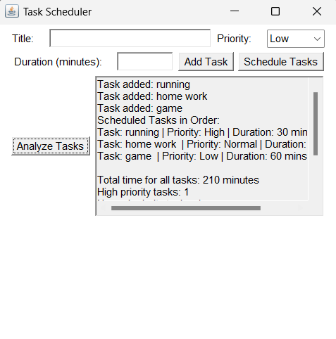

---

# Task Scheduler App

This Java application, created by Shaan Patel, allows users to manage and prioritize tasks based on priority and duration. Tasks can be scheduled and analyzed to help users effectively organize their workload. The app provides a simple GUI built with AWT for adding tasks, scheduling them by priority, and analyzing their total time and efficiency.



## Table of Contents
- [Features](#features)
- [Requirements](#requirements)
- [Installation](#installation)
- [Usage](#usage)
- [Project Structure](#project-structure)
- [Contributing](#contributing)
- [License](#license)

## Features

- **Add Tasks**: Users can add tasks by entering a title, selecting a priority (High, Normal, or Low), and specifying a duration in minutes.
- **Schedule Tasks**: Tasks are sorted by priority (High > Normal > Low), and within the same priority, by shortest duration first.
- **Analyze Tasks**: View a summary of all tasks, including the total time required, number of tasks per priority level, and average task duration.

## Requirements

- **Java Development Kit (JDK)** 8 or higher
- **Java AWT** library (included in standard Java libraries)

## Installation

1. **Clone the repository**:
   ```bash
   git clone https://github.com/Shaan013/TaskSchedulerApp.git
   cd TaskSchedulerApp
   ```

2. **Compile the program**:
   ```bash
   javac TaskSchedulerApp.java
   ```

3. **Run the application**:
   ```bash
   java TaskSchedulerApp
   ```

## Usage

1. **Launch the Application**: Open the Task Scheduler App by running `java TaskSchedulerApp` in your terminal.
2. **Add a Task**:
   - Enter the title of the task.
   - Select the priority level (High, Normal, or Low).
   - Input the duration (in minutes).
   - Click the **Add Task** button.
3. **Schedule Tasks**:
   - Click the **Schedule Tasks** button to view tasks sorted by priority and duration.
4. **Analyze Tasks**:
   - Click the **Analyze Tasks** button to view the summary, including total time required and priority distribution.

## Project Structure

- **Task**: Represents each task with attributes for title, priority, and duration.
- **TaskScheduler**: Manages tasks, including adding tasks, scheduling them by priority, and analyzing task data.
- **TaskSchedulerApp**: The main class, which sets up the GUI and handles user interactions.

## Contributing

Contributions are welcome! Please fork the repository and submit a pull request for any new features or bug fixes.

## License

This project is licensed under the MIT License. 

--- 
